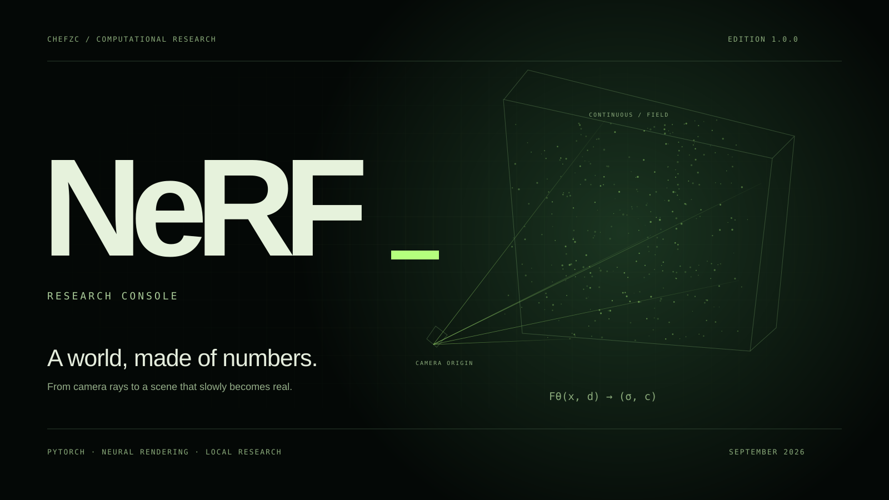
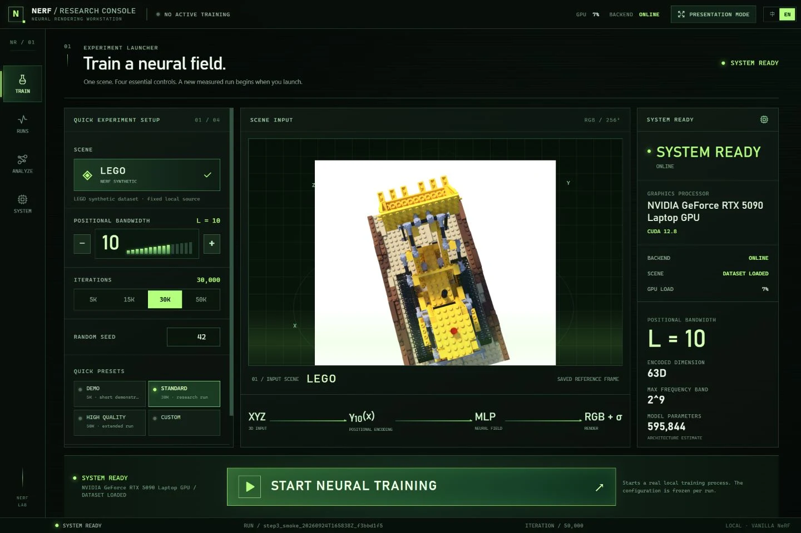
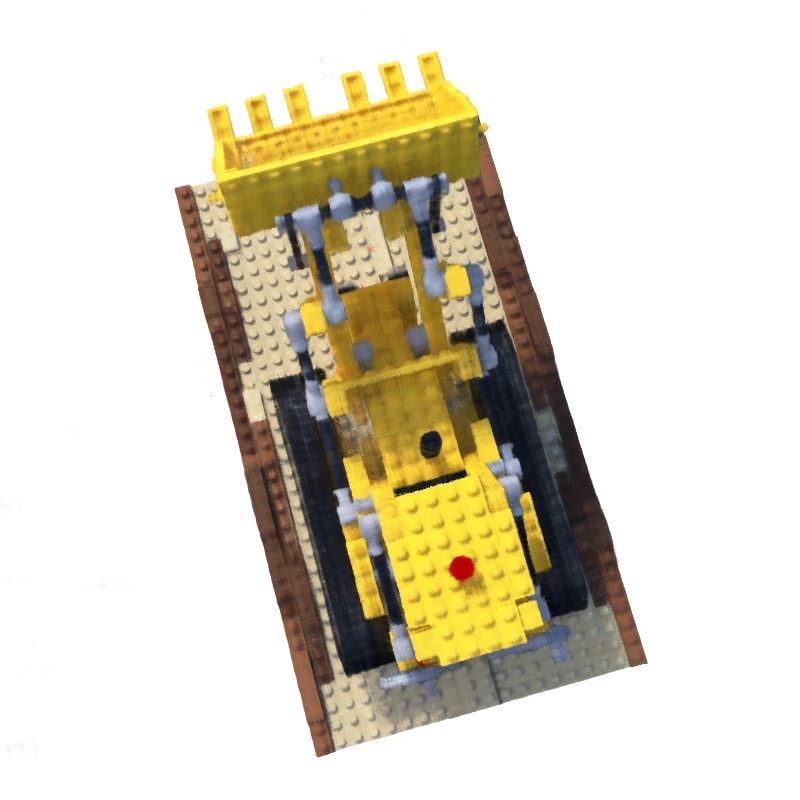

<a href="README.md">简体中文</a> · <b>English</b>

<a href="https://chefzc.dev/nerf.html"><b>ENTER THE FIELD ↗</b></a> &nbsp; / &nbsp; <a href="https://chefzc.dev/post.html?article=nerf">RESEARCH LOG ↗</a> &nbsp; / &nbsp; <a href="https://github.com/ChefDavid0815/nerf-research-console/releases/tag/v1.0.0">SOURCE RELEASE ↓</a>

# NeRF · Research Console

**A world, made of numbers.** An independently implemented vanilla NeRF pipeline and a bilingual local research workstation. Camera rays, positional encoding, coarse/fine sampling and differentiable volume rendering meet an interface in deep black and restrained phosphor green.

**1.0.0 / Research edition.** A learning and engineering foundation for an IB Computer Science question about positional-encoding bandwidth. This release contains working software and recorded engineering evidence; it does not claim a completed bandwidth study.

## From coordinates to a visible world

Images and known camera poses supervise a continuous scene representation. The position branch predicts density and features; viewing direction informs colour. Two separate MLPs support hierarchical sampling; volume rendering accumulates samples into pixels.

~~~mermaid
flowchart LR
  A["Images + camera poses"] --> B["Camera rays"]
  B --> C["Position / direction encoding"]
  C --> D["Coarse MLP · density + colour"]
  D --> E["Weights → inverse-CDF fine sampling"]
  E --> F["Fine MLP"]
  F --> G["Volume rendering"]
  G --> H["RGB loss · saved reconstruction"]
~~~

The implementation is in [src/nerf_step1](src/nerf_step1). Encoding retains raw inputs alongside sin(2^kπx) and cos(2^kπx): position L=10 gives 63 channels; direction L=4 gives 27. The authors' released TensorFlow embedder omits π; this project preserves its explicitly chosen research convention. Rays retain OpenGL −Z forward and integer pixel indices. Directions stay unnormalised; rendering converts parameter intervals into world distances.

[Implementation notes](docs/implementation-notes.md) document skip placement, compositing, resume contracts and metrics. The architecture follows [the original NeRF method](https://www.matthewtancik.com/nerf); this is an independent PyTorch implementation.

## Inside the workstation

| Workspace | Available now |
| :--- | :--- |
| **Train** | Essential settings, advanced parameters, explicit creation and start/stop. Scientific configuration freezes per run. |
| **Runs** | Persistent inventory, configuration, checkpoints and recoverable states. |
| **Analyze** | Saved reconstruction time machine, checkpoint comparison, training/evaluation curves, encoding and per-ray diagnostics. |
| **System** | Local GPU/CPU/RAM telemetry, runtime status and logs. Missing measurements remain unavailable. |

Chinese/English preference stays local. FastAPI exposes REST/WebSocket; Python processes run the science. Electron provides the Windows shell. Opening the console starts no training or bandwidth sweep. This is a local single-user application, intended to bind to loopback.

## A recorded reconstruction

The historical run continues a 500-step engineering smoke checkpoint to **50,000 iterations, 256 rays/batch**, seed 0, position/direction L=10/4, 64/128 coarse/fine samples and white-background compositing. It differs from the 4096-ray configuration in <code>configs/baseline.yaml</code>.

| Selected split / views | PSNR mean ↑ | SSIM mean ↑ | LPIPS mean ↓ |
| :--- | ---: | ---: | ---: |
| Validation / 0, 1, 2 | 27.333 dB | 0.88850 | 0.08770 |
| Test / 0, 1, 2, 66, 133 | 26.055 dB | 0.89022 | 0.09240 |

Full-resolution 800×800 evaluations of these specified views, **not a full-dataset benchmark**. Training-batch PSNR is separate; 100×100 previews are diagnostic. [Raw CSVs, a sampled training curve and provenance](docs/evidence/) retain those boundaries.

Checkpoint SHA-256:
~~~text
0e564e02fc28875a7fde02fa55682566342f06d1252fbbcab5d6581278dd3264
~~~

Dataset, checkpoint and full local archives are not distributed. A clean clone needs the corresponding checkpoint or a new training run to reproduce these exact model images.

## Open the lab

Verified environment: **Windows x64, Python 3.12, Node.js 22, PyTorch 2.8.0 / CUDA 12.8**. CUDA needs a compatible NVIDIA GPU/driver. CPU mode supports software checks and small runs.

~~~powershell
git clone https://github.com/ChefDavid0815/nerf-research-console.git
cd nerf-research-console
py -3.12 -m venv .venv
& .\.venv\Scripts\python.exe -m pip install -r requirements.txt
# CPU alternative: use requirements-cpu.txt instead.
cd console_frontend
npm ci
npm run build
cd ..
~~~

<code>requirements-lock.txt</code> records the observed complete Windows CUDA environment. Direct dependencies are pinned in <code>requirements.txt</code>. [Official PyTorch version instructions](https://pytorch.org/get-started/previous-versions/) document the wheel choices.

Download [official Lego example data](https://github.com/bmild/nerf/blob/master/download_example_data.sh) and place the extracted scene here:

~~~text
data/nerf_synthetic/lego/
  transforms_train.json
  transforms_val.json
  transforms_test.json
  train/   val/   test/
~~~

[Dataset provenance](data/PROVENANCE.md) identifies the original archive. The console neither fabricates nor automatically downloads research data.

In two terminals, from the repository root:

~~~powershell
# Terminal 1 / backend
$env:PYTHONPATH='src'
& .\.venv\Scripts\python.exe -m uvicorn nerf_console.api:app --host 127.0.0.1 --port 8000
~~~

~~~powershell
# Terminal 2 / browser interface
cd console_frontend
npm run dev
# http://127.0.0.1:5173
~~~

For the Windows shell, build first, then run <code>npm run desktop</code> in <code>console_frontend</code>. <code>npm run package:win</code> creates a **workspace-bound** folder under <code>artifacts/</code>, using the clone's virtual environment, dataset and runs. It is not a standalone installer; the source release does not bundle it.

## Training, deliberately

~~~powershell
# Explicitly starts a new engineering smoke run.
& .\.venv\Scripts\python.exe scripts\train_nerf.py --config configs\smoke.yaml --device cuda
# Resume only your own returned run:
& .\.venv\Scripts\python.exe scripts\train_nerf.py --resume runs\<run-id> --device cuda
# Explicit checkpoint, split and views for full-resolution evaluation:
& .\.venv\Scripts\python.exe scripts\evaluate_nerf.py --run runs\<run-id> --checkpoint 500 --split val --views 0 1 2 --device cuda
~~~

Use <code>--device cpu</code> for CPU mode. Every run saves frozen configuration, environment, RNG/optimizer state, CSVs, checkpoints and previews. Resume checks compatibility; scientific changes require a new run. [Architecture and boundaries](docs/research_console.md).

## The project, at a glance

~~~text
src/nerf_step1/               dataset · cameras · encoding · MLP · sampling · rendering
src/nerf_console/             API · process lifecycle · ray diagnostics
src/nerf_console_diagnostics/ read-only research artifact adapters
console_frontend/            React · TypeScript · Vite · Electron
configs/                     baseline and separate smoke configuration
scripts/                     validation · training · evaluation · reports
tests/                       numerical and software contracts
docs/assets/                 actual captures and curated reconstruction images
docs/evidence/               public CSVs, configuration and provenance
data/ · runs/ · artifacts/   local-only data, outputs and packages
~~~

~~~powershell
& .\.venv\Scripts\python.exe -m pytest -q
& .\.venv\Scripts\python.exe -m pip check
cd console_frontend
npm test
npm run build
~~~

Three historical integration tests require the optional local 50k run and explicitly skip in a clean clone. Numerical tests use isolated software fixtures, not invented research observations. [Release verification](docs/RELEASE-VERIFICATION.md) records results and scope.

Next: controlled bandwidth comparisons, additional scenes, periodic full-image validation and more machine/CPU compatibility checks. None runs automatically in this release.

---

Made by **ChefZC**. [Personal space](https://chefzc.dev) · [School Lab](https://chefzc.dev/school-gallery.html#project-nerf) · [Now](https://chefzc.dev/now.html#milestone-nerf).

Original source is MIT licensed. Dataset imagery and dependencies retain their own terms; see [THIRD-PARTY.md](THIRD-PARTY.md).
