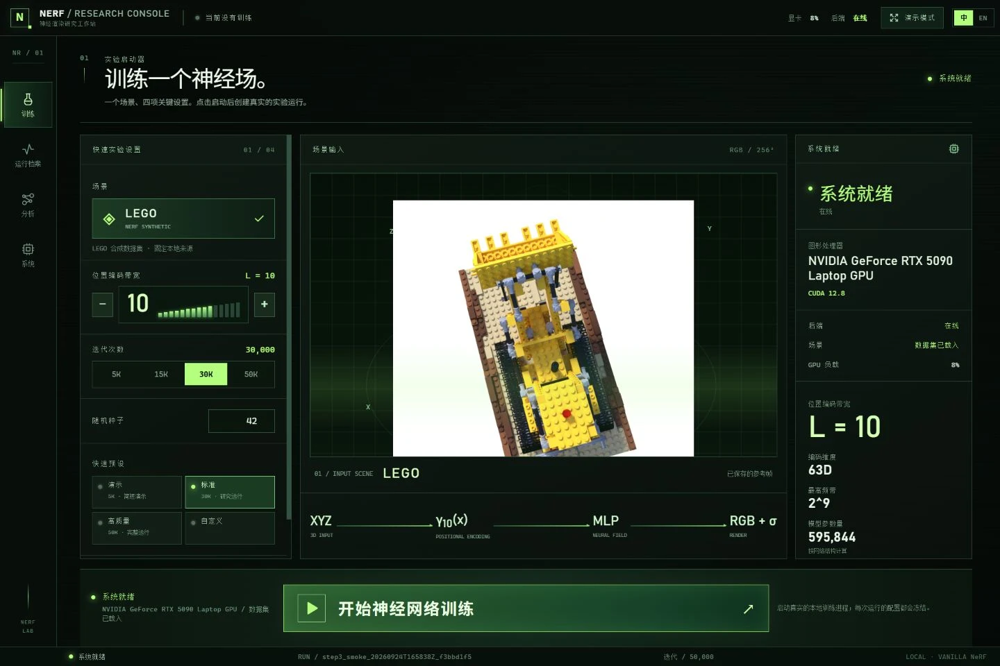

<b>简体中文</b> · <a href="README.en.md">English</a>

<a href="https://chefzc.dev/nerf.html"><b>进入计算空间 ↗</b></a> &nbsp; / &nbsp; <a href="https://chefzc.dev/post.html?article=nerf">研究日志 ↗</a> &nbsp; / &nbsp; <a href="https://github.com/ChefDavid0815/nerf-research-console/releases/tag/v1.0.0">源码发布 ↓</a>

# NeRF · Research Console

**让数学，在屏幕里长出一个世界。** 一个独立实现的 vanilla NeRF 管线与双语本地研究工作台。相机射线、位置编码、coarse/fine 采样与可微体渲染，在深黑、低亮度磷光绿的界面里相遇。

**1.0.0 / Research edition。** 为 IB Computer Science 的位置编码带宽研究搭建的学习与工程基础。公开可运行的软件与真实工程记录；尚未完成带宽比较研究，也没有把预览当成研究结论。

## 从坐标，到一个可以看见的世界

输入图像与已知相机位姿监督连续场景表达。位置分支学习密度与特征，观察方向参与颜色预测。两套独立 MLP 支持层级采样，体渲染将采样值累积为像素。

~~~mermaid
flowchart LR
  A["图像 + 相机位姿"] --> B["相机射线"]
  B --> C["位置 / 方向编码"]
  C --> D["Coarse MLP · 密度 + 颜色"]
  D --> E["权重 → inverse-CDF fine 采样"]
  E --> F["Fine MLP"]
  F --> G["体渲染"]
  G --> H["RGB 损失 · 保存的重建"]
~~~

核心在 [src/nerf_step1](src/nerf_step1)。编码保留原始输入，以及 sin(2^kπx)、cos(2^kπx)：位置 L=10 是 63 维，方向 L=4 是 27 维。原作者发布的 TensorFlow embedder 不含 π；本项目保留明确选定的研究约定。相机采用 OpenGL −Z 前向和整数像素索引，射线不归一化；渲染将参数间距转换为世界距离。

[实现记录](docs/implementation-notes.md) 保留 skip 位置、合成方式、恢复契约和指标定义。方法依据 [原始 NeRF](https://www.matthewtancik.com/nerf)，代码为独立 PyTorch 实现。

## 一台本地的研究仪器

| 工作区 | 当前功能 |
| :--- | :--- |
| **训练 / Train** | 常用设置可见，高级参数展开；显式创建、开始与停止，每次运行冻结研究配置。 |
| **档案 / Runs** | 持久记录、配置、checkpoint 与可恢复状态。 |
| **分析 / Analyze** | 重建时间机、checkpoint 对照、训练与评估曲线、编码与逐射线诊断。 |
| **系统 / System** | 本地 GPU / CPU / RAM 遥测、状态与日志；缺失的值继续为空。 |

双语偏好保存在本机。FastAPI 提供 REST / WebSocket，Python 进程执行科学计算，Electron 提供 Windows 外壳。打开控制台不会自动训练或扫描带宽。它是本地单用户工具，默认绑定 loopback。

## 一次有记录的重建

历史运行从 500 次工程 smoke checkpoint 续训到 **50,000 次，256 rays/batch**：seed 0、位置 / 方向 L=10/4、64/128 coarse/fine samples、白底合成。它与 <code>configs/baseline.yaml</code> 的 **4096-ray 配置不同**。

| 选定 split / 视角 | PSNR 均值 ↑ | SSIM 均值 ↑ | LPIPS 均值 ↓ |
| :--- | ---: | ---: | ---: |
| Validation / 0, 1, 2 | 27.333 dB | 0.88850 | 0.08770 |
| Test / 0, 1, 2, 66, 133 | 26.055 dB | 0.89022 | 0.09240 |

这些是指定视角的 800×800 全分辨率评估，**不是完整数据集 benchmark**。训练批次 PSNR 是另一种测量，100×100 预览是诊断图。[原始 CSV、间隔采样曲线与来源](docs/evidence/) 保留这些区别。

Checkpoint SHA-256：
~~~text
0e564e02fc28875a7fde02fa55682566342f06d1252fbbcab5d6581278dd3264
~~~

数据集、checkpoint 与完整运行档案不分发。全新 clone 需要相应 checkpoint 或重新训练，才能复现该模型图像。

## 打开工作台

已验证：**Windows x64、Python 3.12、Node.js 22、PyTorch 2.8.0 / CUDA 12.8**。CUDA 需要兼容 NVIDIA GPU 与驱动；CPU 可用于软件检查和小规模运行。

~~~powershell
git clone https://github.com/ChefDavid0815/nerf-research-console.git
cd nerf-research-console
py -3.12 -m venv .venv
& .\.venv\Scripts\python.exe -m pip install -r requirements.txt
# CPU 环境：改用 requirements-cpu.txt。
cd console_frontend
npm ci
npm run build
cd ..
~~~

<code>requirements-lock.txt</code> 是已观察的完整 Windows CUDA 环境，<code>requirements.txt</code> 固定直接依赖。wheel 选择见 [PyTorch 官方版本说明](https://pytorch.org/get-started/previous-versions/)。

下载 [官方 Lego 示例数据](https://github.com/bmild/nerf/blob/master/download_example_data.sh)，把解压后的场景放在：

~~~text
data/nerf_synthetic/lego/
  transforms_train.json
  transforms_val.json
  transforms_test.json
  train/   val/   test/
~~~

[数据来源](data/PROVENANCE.md) 记录原始压缩包。控制台不会自动下载、生成或替换研究数据。

从根目录分别打开两个终端：

~~~powershell
# 终端 1 / 后端
$env:PYTHONPATH='src'
& .\.venv\Scripts\python.exe -m uvicorn nerf_console.api:app --host 127.0.0.1 --port 8000
~~~

~~~powershell
# 终端 2 / 浏览器界面
cd console_frontend
npm run dev
# http://127.0.0.1:5173
~~~

Windows 外壳：先 build，再在 <code>console_frontend</code> 执行 <code>npm run desktop</code>。<code>npm run package:win</code> 在 <code>artifacts/</code> 生成**依赖工作区的桌面文件夹**，使用 clone 的虚拟环境、数据和 runs。它不是独立安装包，此次源码 Release 不捆绑它。

## 显式运行训练

~~~powershell
# 这条命令显式开始一个新的工程 smoke run。
& .\.venv\Scripts\python.exe scripts\train_nerf.py --config configs\smoke.yaml --device cuda
# 只恢复你自己创建的 run：
& .\.venv\Scripts\python.exe scripts\train_nerf.py --resume runs\<run-id> --device cuda
# 明确 checkpoint、split 与视角：
& .\.venv\Scripts\python.exe scripts\evaluate_nerf.py --run runs\<run-id> --checkpoint 500 --split val --views 0 1 2 --device cuda
~~~

CPU 使用 <code>--device cpu</code>。每次保存冻结配置、环境、RNG / optimizer 状态、CSV、checkpoint 与预览。恢复先核对兼容性，改变研究参数必须新建 run。[控制台架构与边界](docs/research_console.md)。

## 项目结构与检查

~~~text
src/nerf_step1/               数据 · 相机 · 编码 · MLP · 采样 · 渲染
src/nerf_console/             API · 进程管理 · 射线诊断
src/nerf_console_diagnostics/ 只读研究产物适配器
console_frontend/            React · TypeScript · Vite · Electron
configs/                     baseline 与独立 smoke 配置
scripts/                     验证 · 训练 · 评估 · 报告
tests/                       数值与软件契约
docs/assets/                 实际截图与精选重建画面
docs/evidence/               公开 CSV、配置与来源
data/ · runs/ · artifacts/   本机数据、输出与打包目录
~~~

~~~powershell
& .\.venv\Scripts\python.exe -m pytest -q
& .\.venv\Scripts\python.exe -m pip check
cd console_frontend
npm test
npm run build
~~~

三项历史集成测试依赖可选的本地 50k run，在全新 clone 中明确跳过。数值测试使用隔离软件夹具，不制造研究观测值。[发布验证](docs/RELEASE-VERIFICATION.md) 记录检查结果和范围。

后续：受控带宽比较、更多场景、周期性全图验证，以及更多机器和 CPU 环境检查。本次发布不会自动执行这些研究。

---

Made by **ChefZC**。[个人空间](https://chefzc.dev) · [学校展厅](https://chefzc.dev/school-gallery.html#project-nerf) · [Now](https://chefzc.dev/now.html#milestone-nerf)。

原创源码采用 MIT；数据集图像与依赖保留各自条款，见 [THIRD-PARTY.md](THIRD-PARTY.md)。
